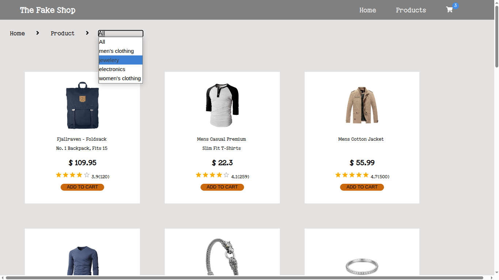
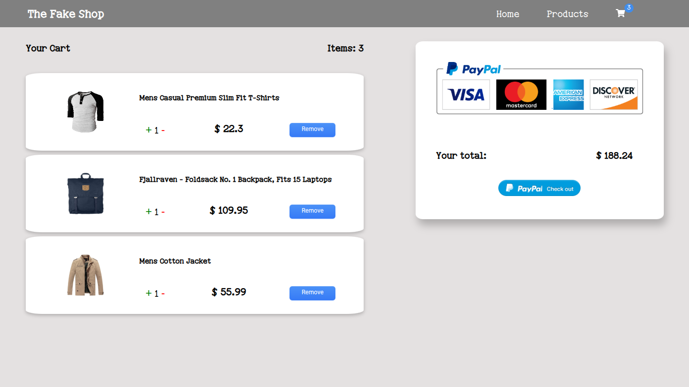

# 🛍️ Shopping Cart App

A simple and interactive shopping cart built with vanilla JavaScript. Users can add items to their cart, adjust quantities, and view dynamic total costs — all in a clean, responsive layout.

## 🚀 Features

- 🧺 Add and remove items from cart
- 🔢 Update item quantities
- 💵 Live subtotal and total price calculation
- ✅ Input validation
- 📱 Responsive design for desktop and mobile

## 🖼️ Screenshots

 
 
 

## 🛠️ Tech Stack

- HTML5
- CSS3
- JavaScript (ES6+)